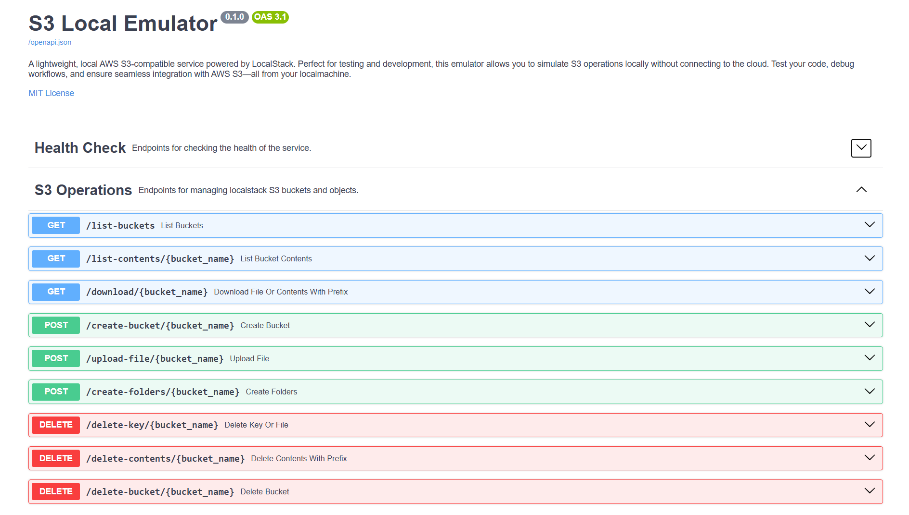

# S3 Local Emulator
A lightweight, local AWS S3-compatible service powered by [LocalStack](https://www.localstack.cloud/). Perfect for testing and development, this emulator allows you to simulate S3 operations locally without connecting to the cloud. Test your code, debug workflows, and ensure seamless integration with AWS S3—all from your localmachine.

Provides pre-built APIs to create, delete S3 Buckets/keys, upload & download files. S3 can be accessed using `localhost:4566`.

## How To Use:
### Using Docker:
1. Build the `Dockerfile` with name `s3-local-py`
    ```sh
    docker build -t s3-local-py .
    ```
2. Run `docker-compose`
    ```sh
    docker-compose up -d
    ```
3. Once the application starts running, you can access the swagger UI from [http://localhost:8773/swagger](http://localhost:8773/swagger)
    
4. Terminate the container when no longer needed.
    ```sh
    docker-compose down
    ```
---
### Using Python locally:
1. Python version `3.10+` required.
2. Start a python virtual environment _(optional)._
    ```sh
    python -m venv .venv
    source .venv/Scripts/activate
    ```
3. Install required packages.
    ```sh
    pip install -r requirements.txt
    ```
4. Start the `FastApi` application
    ```sh
    uvicorn main:app --host 0.0.0.0 --port 8773 --reload
    ```
    This starts the fast-api server on port `8773` & with `--reload` flag, host reloading is enabled. Once the application starts access the swagger UI from [http://localhost:8773/swagger](http://localhost:8773/swagger)

---
_**NOTE:** In localstack once the containers are terminated, the buckets & its data is lost._